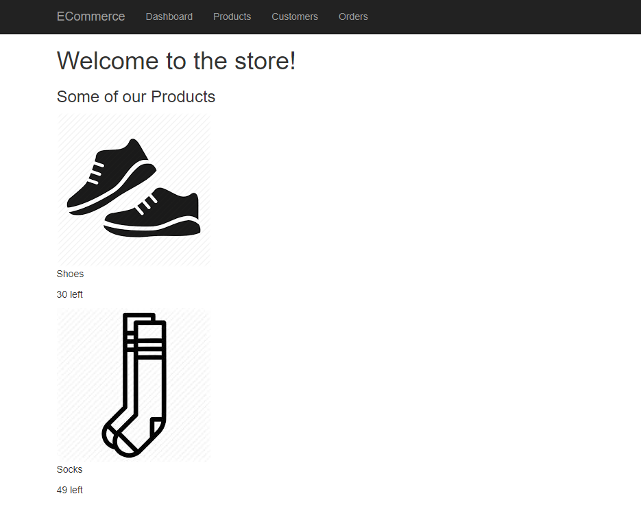
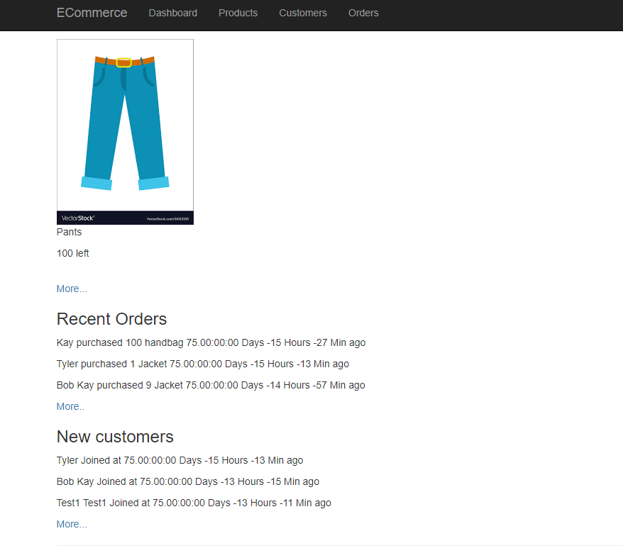
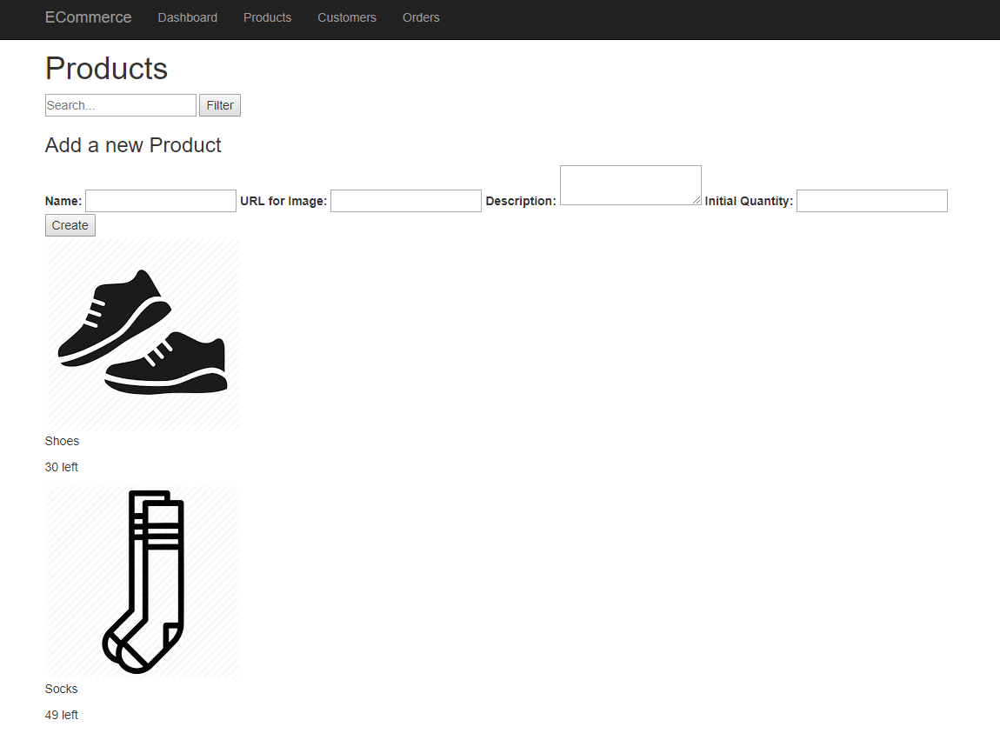
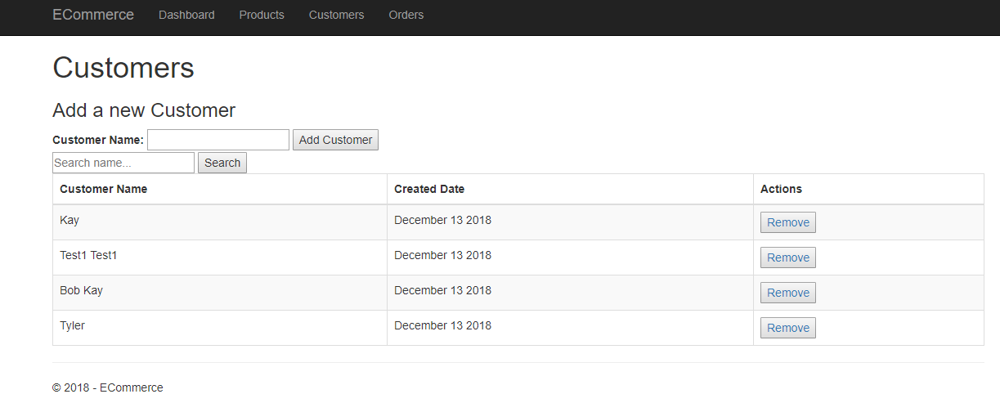
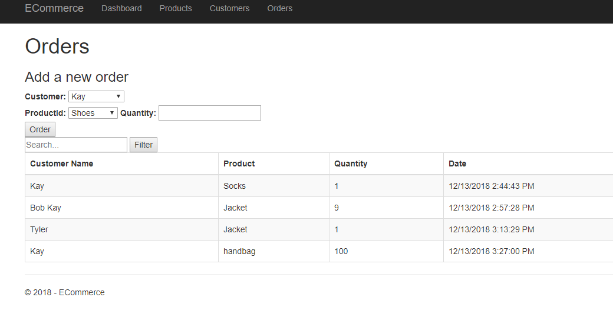

# E-Comerce
E-Commerce website that allows retailers to manage product stock, customers, and orders.

## Technologies used
- C#
- HTML
- CSS
- Bootstrap
- ASP.NET Core
- Entity Framework
- MySQL
- Linq

## Features
- View list of products and its stocks

- Last 3 recent orders
- Last 3 recently added new customers

- Search/filter by product name
- Create new product data

- List of all customers and ability to delete them
- Search/ filter customer name
- Add new customer

- Add new order linked to a product and a customer
- Reduce quantity of product stock by the ordered quantity
- List all the orders
- Search/ filter orders with any matching keyword

## Database:
- Products: one to many with orders
- Customers: one to many with orders
- Orders: links many to many relationship between products and customers